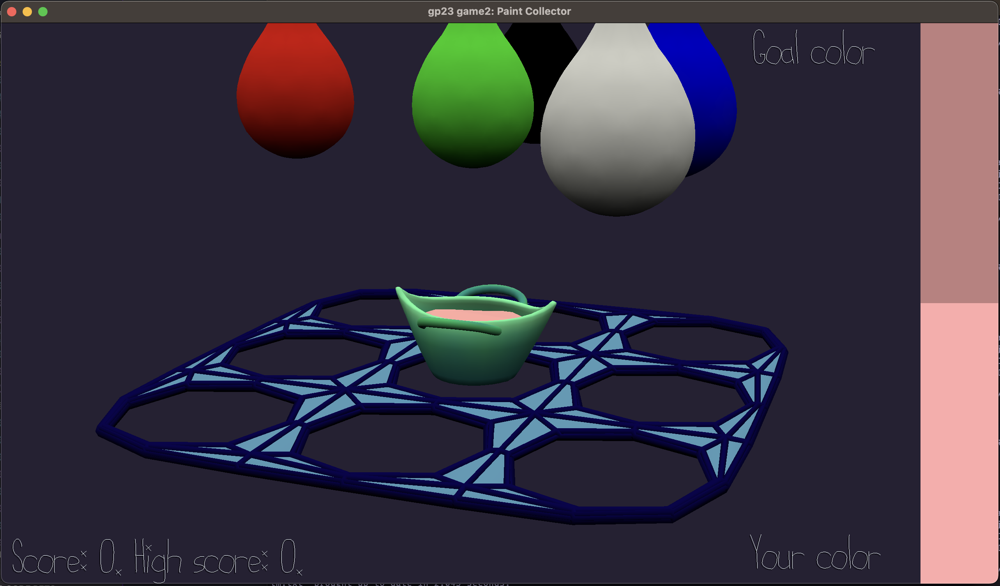

# Paint Collector

Author: Sasha Mishkin

Design: This is a color-mixing game where your objective is to mix the shown goal color from a set of a few primary colors, but you have to do this fast (i.e. catch the falling paint drops into your basket). The drops also get progressively faster as more of them fall, but if you mess up, they become slow again, just because they're nice.

Screen Shot:

How To Play:

Use arrow keys to move the basket around on the grid and try to catch the paint drops. Your basket starts out with white paint in it. You will see a "goal color" at the top right of your screen and you should try to collect the raindrops that, when mixed together with the starting white paint, create the goal color. If you collect all the right colors for the goal color (using as few drops as possible), you earn points (and a new goal is set, and your paint resets to white). If you collect an incorrect drop, your score resets to 0 and your paint resets to white.

This game was built with [NEST](NEST.md).
